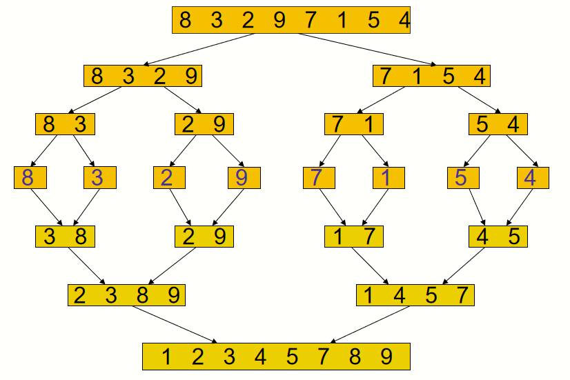

# 分治法

将整个问题分解成若干小问题后再分而治之。如果分解得到的子问题相对来说还是太大，则可反复使用分治策略将这些子问题分成更小的同类型子问题，直至产生方便求解的子问题，必要时逐步合并这些子问题的解，从而得到问题的解。

## 递归

分治算法可以由递归过程来表示，因为分治法就是一种找大规模问题与小规模问题关系的方法，是递归设计的一种具体策略。

递归是一种解决问题的方法，它把一个问题分解为越来越小的子问题，直到问题的规模小到可以被很简单直接解决。通常为了达到分而治之的目的，递归过程要调用自身。

## 思路

1. **分解(Divide)**  
   将原问题分解为若干规模较小，相互独立，与原问题相同的子问题。

2. **解决(Conquer)**  
   若干子问题较小而容易被解决则直接解决，否则再继续分解为更小的子问题，直到容易解决。

3. **合并(Combine)**  
   将已求解的各个子问题的解，逐步合并为原问题的解。

有的问题分解后不需要合并子问题的解，此时就不需要再做第 3 步了。多数问题需要子问题的解，按照题意使用恰当的方法合并成为整个问题的解。需要具体问题具体分析。

## 算法框架

```cpp
Divide-and-Conquer(int n){
	if(n<=n0){//n为问题规模 ,n0为可解子问题的规模
		解子问题;
		return(子问题的解);
	}
	for(i=1;i<=k;i++){//分解成较小的子问题p1,p2,...,pk
		yi=Divide-and-Conquer(|Pi|);//递归解决
	}
	T=MERGE(y1,y2,...yk);//合并子问题
	return(T);//返回问题的解
}
```

## 递归算法

一个递归算法通常包含递归地调用该算法本身，传入较小的参数。

递归算法的中止条件：处理基本情况，这些情况不可以有任何递归调用。

比如求 `n!`

```cpp
int fact(int n) {
    if (n<=1)
        return 1;
    else
        return n*fact(n-1);
}
```

以及归并排序


```cpp
#include <iostream>
#include <vector>

void merge(std::vector<int>& array, int const left, int const mid, int const right) {
    auto const subArrayOne = mid - left + 1;
    auto const subArrayTwo = right - mid;

    // 创建临时数组
    std::vector<int> leftArray(subArrayOne),
                     rightArray(subArrayTwo);

    // 复制数据到临时数组
    for (auto i = 0; i < subArrayOne; i++)
        leftArray[i] = array[left + i];
    for (auto j = 0; j < subArrayTwo; j++)
        rightArray[j] = array[mid + 1 + j];

    auto indexOfSubArrayOne = 0, // 初始索引第一个子数组
        indexOfSubArrayTwo = 0; // 初始索引第二个子数组
    int indexOfMergedArray = left; // 初始索引合并后的数组

    // 合并临时数组回到原数组
    while (indexOfSubArrayOne < subArrayOne && indexOfSubArrayTwo < subArrayTwo) {
        if (leftArray[indexOfSubArrayOne] <= rightArray[indexOfSubArrayTwo]) {
            array[indexOfMergedArray] = leftArray[indexOfSubArrayOne];
            indexOfSubArrayOne++;
        } else {
            array[indexOfMergedArray] = rightArray[indexOfSubArrayTwo];
            indexOfSubArrayTwo++;
        }
        indexOfMergedArray++;
    }
    // 复制剩余元素
    while (indexOfSubArrayOne < subArrayOne) {
        array[indexOfMergedArray] = leftArray[indexOfSubArrayOne];
        indexOfSubArrayOne++;
        indexOfMergedArray++;
    }
    while (indexOfSubArrayTwo < subArrayTwo) {
        array[indexOfMergedArray] = rightArray[indexOfSubArrayTwo];
        indexOfSubArrayTwo++;
        indexOfMergedArray++;
    }
}

void mergeSort(std::vector<int>& array, int const begin, int const end) {
    if (begin >= end)
        return; // 结束条件

    auto mid = begin + (end - begin) / 2;
    mergeSort(array, begin, mid);
    mergeSort(array, mid + 1, end);
    merge(array, begin, mid, end);
}

int main() {
    std::vector<int> arr = {8, 3, 2, 9, 7, 1, 5, 4};
    mergeSort(arr, 0, arr.size() - 1);

    std::cout << "排序后的数组: ";
    for (int i = 0; i < arr.size(); i++)
        std::cout << arr[i] << " ";
    std::cout << std::endl;

    return 0;
}
```

## 步骤

1. **考虑终止条件** 即分治法划分到最小问题的边界是什么。比如当前仅有一个元素不可再分；还包括一些实际场景的特例，表示该方法到此就已经停止了，不继续往下分。

2. **考虑划分** 最常使用的划分方法即为二分法，将序列分为两个相同或相似的问题，且一步一步递归到上述的终止条件中。

3. **合并结果** 此时我们经过多次划分计算得到的子问题的结果，在此时应当考虑返回的最终结果为何。
